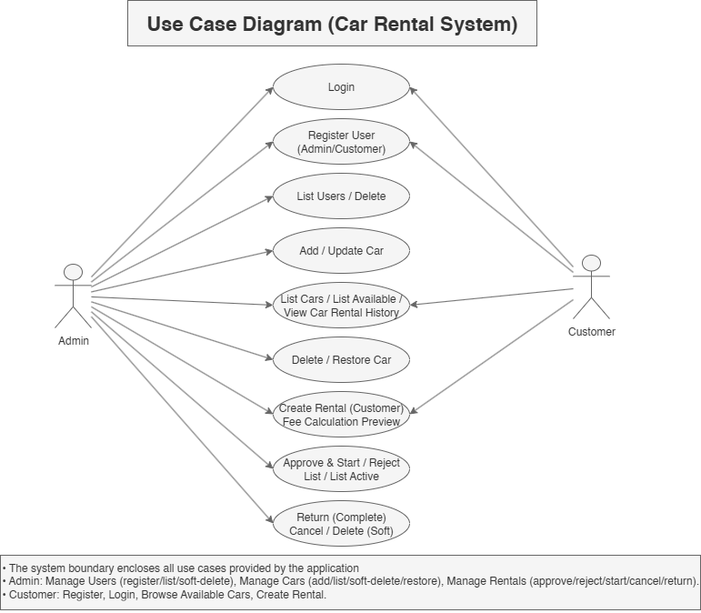
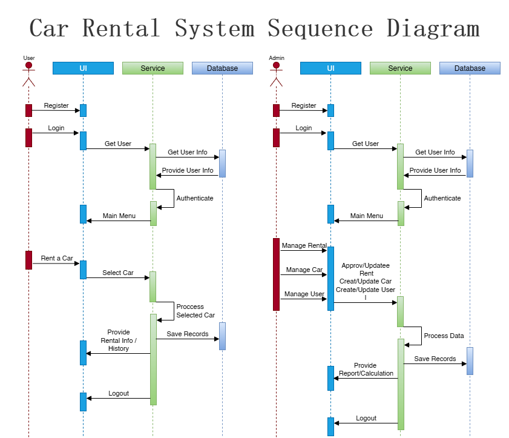
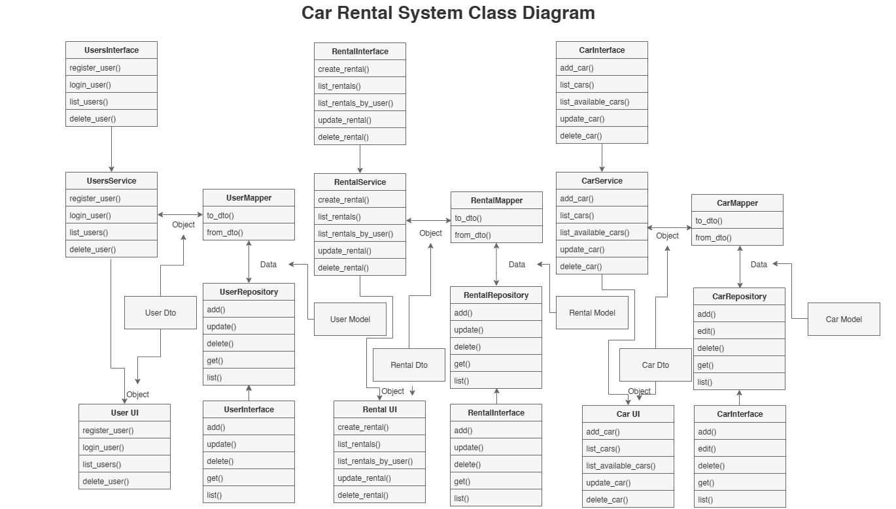

# Car Rental System – Documentation  

**Version:** 1.0.0 (Stable Release)  

Car Rental System is designed to automate the rental process, replacing manual paperwork with a digital solution. It enables user and car management, booking requests, and rental life cycle management.  

The platform has been implemented using **Object-Oriented Programming (OOP)** principles, a **layered architecture**, and multiple **design patterns** (Repository, Service Layer, DTOs, Singleton for DB Manager).  

---

## 1. User Documentation  

### Overview  
Car Rental System The purpose of the Car Rental System application is to automate the rental system.  

It replaces the manual paperwork with a digital solution that enables user and car management, booking requests and rental life cycle management.  

This platform has been implemented following OOP (Object-Oriented Programming), multilayer-based development and also applying Design Patterns (Repository, Service Layer, DTO’s, Singleton for DB Manager).  

---

### Installation & Configuration  

#### Requirements  

```text
fastapi==0.110.0
uvicorn[standard]==0.29.0
SQLAlchemy==2.0.29
passlib[bcrypt]==1.7.4
pydantic==2.6.3
alembic==1.13.1
python-dotenv==1.0.1
pytest==8.2.2
faker==25.0.0
httpx==0.28.1
```

#### Setup Steps  

```bash
# Clone the repository or extract the ZIP
git clone https://github.com/retiangson/MSE800_Car_Rental.git
cd CarRentalSystem

# Create virtual environment
python -m venv venv
source venv/bin/activate   # On Windows: venv\Scripts\activate

# Install dependencies
pip install -r requirements.txt
```

---

### Running the Application  

**Option A: CLI Mode**  
```bash
python main.py
```  
This launches the **Main Menu** in console mode.  

**Option B: Build as Executable**  
```bash
pyinstaller --onefile --console main.py
```  
This creates a standalone executable in the `dist/` folder.  
Run it with:  
```bash
dist/main.exe   # On Windows
```  

**Option C: Run API Server (Admin Only)**  
From the Admin Main Menu → choose **Run API Server**, or run manually:  
```bash
uvicorn api.main:app --reload
```  
Server starts at: [http://127.0.0.1:8000](http://127.0.0.1:8000)  

API Docs:  
- Swagger → [http://127.0.0.1:8000/docs](http://127.0.0.1:8000/docs)  
- ReDoc → [http://127.0.0.1:8000/redoc](http://127.0.0.1:8000/redoc)  

**Option D: Prebuilt Standalone Package**  
Download `car_rental_standalone.zip`, extract it, and run:  
```bash
car_rental.exe
```  
This version does not require Python or dependencies.  

---

### Initial Admin Access  

At the first load, this system automatically creates an **Admin user** if no other users are found on initial start-up of the system.  

- **Username:** `admin`  
- **Password:** `admin`  

You should log in with Admin as soon as the site is up and running and create some **new users** to handle roles correctly.  

---

### Running Tests  

Tests reside in the `tests/` directory and use **pytest**.  

Run all tests with:  
```bash
pytest
```  

Run tests with detailed output:  
```bash
pytest -v
```  

Run a specific test file:  
```bash
pytest tests/test_car_service.py
```  

---

### Project Structure & File Purpose  

```
MSE800_Car_Rental/
│── main.py                # Entry point – loads Main Menu
│
├── ui/                    # User Interface Layer
│   ├── MainMenu.py        # Admin & Customer main navigation
│   ├── Car.py             # Add/List/Delete/Restore cars
│   ├── Rental.py          # Create/Approve/Return/Cancel rentals
│   ├── Login.py           # Login screen
│   ├── Customer.py        # Customer registration UI
│   └── Employee.py        # Admin (user management)
│
├── Business/              # Service Layer
│   ├── Services/
│   │   ├── CarService.py
│   │   ├── RentalService.py
│   │   └── UserService.py
│   └── Interfaces/        # Service Interfaces (Abstraction)
│
├── Domain/                # Domain Layer
│   ├── Models/            # Core entities: User, Car, Rental, Vehicle
│   ├── DTOs/              # Data Transfer Objects
│   ├── Mappers/           # Map Models ↔ DTOs
│   ├── Repositories/      # Database access (UserRepo, CarRepo, RentalRepo)
│   └── DBManager.py       # Singleton DB session manager
│
├── tests/                 # Unit tests (pytest)
│
├── requirements.txt       # Dependencies
├── README.md              # User Documentation
└── LICENSE                # License terms
```

**File Purposes:**  
- **UI** → Handles input/output and menus.  
- **Business/Services** → Business logic (rules like "only available cars can be rented").  
- **Domain** → Entities, DTOs, Mappers, Repositories, DB connection.  
- **Tests** → Ensure reliability.  
- **main.py** → Entry point.  

---

### Roles & Features  

**Admin Features**  
- Manage Users (register, list, soft-delete)  
- Manage Cars (add, update, delete, restore, list available cars)  
- Manage Rentals (approve, reject, start, cancel, return)  
- Run API Server  

**Customer Features**  
- Register / Login  
- Browse available cars  
- Create rental & preview fees  
- View rental history  

---

### System Design  

- **Use Case Diagram:** shows Admin & Customer interactions  
- **Sequence Diagram:** illustrates request → UI → Service → Database flow  
- **Class Diagram:** represents layered architecture (UI, Services, Repositories, DTOs, Models)  

---

## 2. License  

Car Rental System License  

Copyright (c) 2025 Ronald Ephraim S. Tiangson  

This work was conducted as part of the Master of Software Engineering (MSE800) course,  
including at Yoobee College, New Zealand for educational and academic use.  

---  

## Permission  
Permission is granted at no cost to any person obtaining a copy of this software  
and accompanying documentation files (the “Software”), to deal in the Software without restriction,  
including without limitation the rights to use, copy, modify, merge, publish and  
distribute Software, for commercial or nonprofit use in source and binary forms provided that the following conditions are met:  

---  

## Free Distribution  
- Software should always stay free of cost.  
- You are not allowed to sell, sublicense or otherwise charge for copies of the Software itself.  

---  

## Commercial Use Allowed  
- You may utilize the Software in commercial projects or services so long as the number of yytype must not exceed 10 per company or organization NOT based on payment received for each instance.  
- Software is not a product by itself.  

---  

## Attribution  
- Notice and this permission notice shall be included in all copies or substantiaL 8 portions of the Software.  
- (c) the above copyright notice, the abovE- 9 permission notice and the following disclaimer shall appear in all copies or subst<"liantialHg 10 PORTIONS OF THE SOFTWARE.  
- (Master of Software Engineering, Yoobee) All rights reserved.  
- or large portions of the Software.  

---  

## License Changes  
- Any such terms may be updated or modified at any time by the copyright holder.  
- You accept the most current form of the License by using Software.  

---  

## No Warranty  
THE SOFTWARE IS PROVIDED "AS IS", WITHOUT WARRANTY OF ANY KIND, EXPRESS OR IMPLIED,  
INCLUDING BUT NOT LIMITED TO THE WARRANTIES OF MERCHANTABILITY, FITNESS FOR A PARTICULAR PURPOSE AND NONINFRINGEMENT.  

THE AUTHORS OR COPYRIGHT HOLDERS BE LIABLE FOR ANY CLAIM, DAMAGES OR OTHER DEALINGS IN THE SOFTWARE.  

HOLDERS BE LIABLE FOR ANY CLAIM, DAMAGES OR OTHER LIABILITY, WHETHER IN AN ACTION,  
WHETHER IN AN ACTION OF CONTRACT, TORT OR OTHERWISE, ARISING FROM, OUT OF OR IN CONNECTION WITH THE SOFTWARE OR_THE USE_OR_OTHER DEALINGS IN THE SOFTWARE.  

OR THE USE OR OTHER DEALINGS IN THE SOFTWARE.  

---

## 3. Known Issues / Bugs  

- UI currently runs in console only (no GUI frontend).  
- Database defaults to SQLite (`car_rental.db`). Multi-user concurrency may need PostgreSQL or MySQL.  
- Limited validation on rental dates (future enhancement).  
- No payment integration yet (future feature).  

---

## 4. Future Enhancements  

In order to make the car renting system extendable in future releases, the following functionality is going to be provided:  

- **Mobile Application**  
  We are going to develop a mobile app (iOS and Android).  
  They’ll be able to peruse available cars, make reservations and handle booking on their smartphones.  

- **Web Application via API**  
  A web application that talks to the Car Rental System using RESTful API’s.  
  Thus both users and admins will be able to work with the system from any browser, regardless of the console-based interface.  

These updates will make the system easier to use and more accessible for our users, while aligning with modern industry-standard best practices.  

---

## 5. Developer Credit  

**Car Rental System** was developed by:  

**Name:** Ronald Ephraim Tiangson  
**Programme:** Master of Software Engineering (MSE800)  
**Institution:** Yoobee College, New Zealand  
**Supervisor Name:** Mohammad Norouzifard  
**Date:** September 2025  
**Contact:** retiangson@gmail.com  

---


# Coding Standard – Car Rental System

It explains how Car Rental System complies with coding standards expected in such a project.

---

## Modularity and Encapsulation

The system is separated into distinct layers — UI, Business, Domain, and Data. There is only one responsibility per class:

* `CarRepository` only deals with saving &
* `CarService` is responsible for rules about cars.
* DTOs and Mappers help to pass data safely without exposing database information.

It is easier to maintain, to test, and to extend.

---

## Performance Considerations

It uses **SQLAlchemy** with SQLite.

* It is a **Singleton** so that the app does not waste time reconnecting whenever it needs a database.
* For a project of this size, setup is fast and efficient.
* It doesn't yet include advanced optimizations such as caching but is set to handle larger improvements down the road.

Performance is good for project scope.

---

## Commenting and Documentation

There are informative **docstrings** to comment about methods and classes. In addition to that, the project supplies:

* A comprehensive **README** file with information about installation and usage.
* Separately **User** and **System Documentation** PDFs.
* **UML diagrams** (Class, Sequence, Use Case) to explicitly present design.

Good documentation is one of the project's strengths.

---

## Indentation and Formatting

It follows **PEP8 conventions**:

* Consistent 4-space indentation.
* Clear and easy-to-read formatting.
* No issues with mixed spaces/tabs.

It's a tidy-looking code.

---

## Naming Conventions

It uses systematic and unambiguous naming throughout:

* Classes also employ **PascalCase** (e.g., `CarService`, `RentalRepository`).
* Functions and methods use **snake\_case** (e.g., `list_users`, `create_rental`).
* Interfaces also contain a prefix `I` (e.g., `ICarService`, `IRentalService`).
* DTOs and Mappers follow a predictable pattern (`UserDto`, `UserMapper`).

It simplifies a code to make it easier to understand.

---

## Final Evaluation

| Guideline                  | Rating       | Notes                                                       |
| -------------------------- | ------------ | ----------------------------------------------------------- |
| Modularity & Encapsulation | Strong       | Clear division of concerns                                  |
| Performance Considerations | Good         | Optimized with Singleton DBManager, could add caching later |
| Commenting & Documentation | Outstanding  | Extensive documentation and diagrams                        |
| Indentation & Formatting   | Clean        | PEP8-compliant and consistent                               |
| Naming Conventions         | Inconsistent | Random with no overall strategy or standard                 |

**General:** It's a good example of good coding practices. It is easy to read and document as a module. Advanced performance tuning is where it can be improved but for its scope it is good enough.


---

# Support & Maintenance of Car Rental System 
Current Stable Release: v1.0.0

This plan discusses steps that will keep all of the software, hardware and processes utilized to run the Car Rental System up to date over its lifecycle.

---

## 1. Software Maintenance Management

**Layered Architecture**
It allows you to break down each system into UI layer, Business Layer, Domain Layers and Data layers so that with minimal impact the components can be updated without much impact on the application as a whole.

**Bug Fixes**
Defects can be addressed in their seprare layer (for example fixing validation in RentalService does not touch the database logic).

**Documentation**
Good documentation – such as User Guides, System Documentation, UML diagrams and Coding Standards all assist the new developer to slot into the development process faster.

**Testing**
Unit tests, in the pytest format, make it difficult for developers to break features with refactoring.

Together, these practices provide a solid basis for the long-term maintenance of software.

---

## 2. Versioning

The project follows the guidelines of Semantic Versioning (SemVer):

* **MAJOR version** - when you make incompatible API changes, or very rarely for structural changes that break backwards compatibility.
* **MINOR version** – when you add functionality in a backwards compatible manner.
* **PATCH version** - for fixing bugs and making small improvements.

**Example versions:**

* v1. 0. 0 – Initial stable release
* v1. 1. 0 - new feature (rental fee calculator or any other)
* v1. 1. 1- Fixed a bug

Each version is well marked with a tag for easy tracking in github.

## How to Add a New Version

To ensure that the Car Rental System follows a clear and structured versioning strategy, each release should be assigned a version number using **Semantic Versioning (SemVer)**.

**Steps to add or update the version:**

1. **Update Version File**

   * Edit the `version.py` file in the project root:

     ```python
     # version.py
     __version__ = "1.0.0"
     ```
   * This file keeps track of the current release version.

2. **Display Version in Application**

   * In `main.py` (or your entry point), import and print the version:

     ```python
     from version import __version__
     print(f"Car Rental System - Version {__version__}")
     ```
   * This makes the version visible when the system runs.

3. **Update Documentation**

   * Add the version number at the top of the `README.md` file:

     ```
     # Car Rental System
     **Version:** 1.0.0 (Stable Release)
     ```
   * Update `MaintenanceAndSupport.md` to reflect the current stable version.

4. **Tag the Version in GitHub** (if using Git)

   ```bash
   git tag -a v1.0.0 -m "Stable Release v1.0.0"
   git push origin v1.0.0
   ```

   * Tags allow anyone to download the exact version of the project.

---

### Example:

* Current stable version: **v1.0.0**
* Next feature release: **v1.1.0**
* Bug fix release: **v1.1.1**

---

 By following this process, the Car Rental System can evolve in a controlled way, with each change clearly tracked and documented.


---

## 3. Backward Compatibility

To be compatible with prior versions as the system changes:

**DTOs and Mappers**
DTO acts as a middleware layer between the internal db and your external interfaces (UI, API), protecting them from changes in the internal storage.

**Database Migration Strategy**
Schema changes will be managed with Alembic to enable controlled and incremental upgrades without any loss of data.

**API Stability**
Older versions will continue to be available in case RESTful endpoints are added (for instance, via FastAPI) as well, and users can transition.

**Deprecation Policy**
Deprecated features shall be documented explicitly and supported for at least one minor release before removal.

This method enables contiuing use of an old terminal even when new functionalities are developed.

---

## Summary

Car Rental System is designed for sustainability in the long term:

* Maintenance is straightforward as a modular structure and comprehensive documentation has been utilized.
* SemVer is employed for versioning in a straightforward, senseful manner.
* It maintains compatibility through protective data layers, cautious database migrations and thoughtful deprecation policies.

All of the major components discussed on the rubric will be addressed in this plan to help keep your system maintainable, extensible, and reliable. 

---

# System Documentation

## 1. System Architecture

The Car Rental System is implemented with a **Layered Architecture**, ensuring separation of concerns and modular design:

* **UI Layer**

  * Classes: `CarUI`, `CustomerUI`, `UserUI`, `RentalUI`, `LoginUI`, `MainMenu`.
  * Purpose: Handles user interactions, displays menus, and passes user input to the Business Layer.

* **Business Layer (Service Layer)**

  * Classes: `CarService`, `RentalService`, `UserService` (with interfaces `ICarService`, `IRentalService`, `IUserService`).
  * Purpose: Implements business rules (e.g., only available cars can be rented). Acts as the core logic of the application.

* **Domain Layer**

  * Models: `Car`, `User`, `Rental`, `Vehicle`.
  * DTOs: `CarDto`, `UserDto`, `RentalDto`.
  * Mappers: `CarMapper`, `UserMapper`, `RentalMapper`.
  * Purpose: Defines entities and data transformation between persistence and business logic.

* **Data Layer (Persistence)**

  * Repositories: `CarRepository`, `UserRepository`, `RentalRepository`.
  * `DBManager`: Singleton managing the database session.
  * Purpose: Handles persistence (CRUD operations) with SQLAlchemy and SQLite.

This layered separation improves **maintainability, testability, and scalability**.

---

## 2. Design Patterns in Use

### Repository Pattern

* Classes: `CarRepository`, `UserRepository`, `RentalRepository`.
* Purpose: Abstract database access, providing a clean API for services.
* Benefit: Decouples business logic from persistence, enables mocking in tests.

### Service Layer Pattern

* Classes: `CarService`, `RentalService`, `UserService`.
* Purpose: Encapsulates business rules, implements interfaces for flexibility.
* Example: RentalService ensures only available cars can be rented.

### Data Transfer Object (DTO) Pattern

* DTOs: `CarDto`, `UserDto`, `RentalDto`.
* Purpose: Transfer data safely between layers without exposing database entities.
* Benefit: Enhances encapsulation, allows independent evolution of internal models.

### Mapper / Adapter Pattern

* Classes: `CarMapper`, `UserMapper`, `RentalMapper`.
* Purpose: Converts between domain models and DTOs.
* Benefit: Isolates transformation logic in one place.

### Dependency Inversion Principle (via Interfaces)

* Services depend on abstractions (`ICarService`, `IRentalService`) not implementations.
* Repositories follow the same principle.

### Factory / Installer Pattern

* `ServiceInstaller`: Wires up repositories and services.
* Purpose: Acts as a manual Dependency Injector.

---

## 3. SOLID Principles

1. **Single Responsibility Principle (SRP)**

   * Each class has one purpose (e.g., `CarRepository` only persistence, `CarService` only logic).

2. **Open/Closed Principle (OCP)**

   * System can be extended (new repositories, new DB engines) without modifying existing code.

3. **Liskov Substitution Principle (LSP)**

   * Interfaces allow swapping implementations without breaking functionality.

4. **Interface Segregation Principle (ISP)**

   * Interfaces are small and specific (`ICarService` handles only car-related operations).

5. **Dependency Inversion Principle (DIP)**

   * High-level modules (`CarService`) depend on abstractions, not concrete repositories.

---

## 4. Best Practices Evident

* **Separation of Concerns**: UI, business, and data persistence layers are decoupled.
* **Encapsulation**: DTOs protect internal models from leaking into UI.
* **Testability**: Interfaces allow mocking repositories/services for unit testing.
* **Scalability**: Adding new services/entities is straightforward.
* **Maintainability**: Database changes don’t directly impact business logic.

---

## 5. Areas for Improvement

1. **Dependency Injection Framework**

   * Replace manual `ServiceInstaller` with a DI container (e.g., FastAPI’s dependency injection).

2. **Error Handling & Validation Layer**

   * Add validation services for input (e.g., rental dates, user data).

3. **Domain-Driven Design (DDD)**

   * Define aggregates (e.g., Rental aggregate with car + user rules).

4. **Event-Driven Architecture / Observer Pattern**

   * Example: Trigger “Car Availability Updated” event when a rental is created or completed.

---

## 6. UML Diagrams

### Use Case Diagram

* **Actors**: Admin, Customer.
* **Admin Use Cases**: Manage Users, Manage Cars, Manage Rentals.
* **Customer Use Cases**: Register, Login, Browse Cars, Create Rentals.
  
---

### Sequence Diagram

* Shows flow between **User → UI → Services → Database**.
* Captures login, rental creation, approval, and return processes.
  
---

### Class Diagram

* **UI Classes** ↔ **Service Classes** ↔ **Repository Classes** ↔ **Domain Models & DTOs**.
* Demonstrates layered architecture and decoupling.
  
---

## 7. Summary

The Car Rental System demonstrates:

* **Layered Architecture** for clean separation.
* Use of **Repository, Service Layer, DTO, Mapper, Dependency Inversion** patterns.
* Compliance with **SOLID principles**.
* Application of **best practices** in maintainability, scalability, and testability.

Together, the UML diagrams and architectural choices ensure the system is **robust, extensible, and professionally engineered**. 

---

## Test Results (pytest -v)  
\============================= test session starts =============================

platform win32 -- Python 3.10.8, pytest-8.4.2, pluggy-1.6.0
cachedir: .pytest\_cache
rootdir: D:\Users\retia\OneDrive\Documents\Ron School\MSE800\_Car\_Rental
plugins: anyio-4.10.0, Faker-37.6.0
collecting ... collected 44 items

tests/IntegrationTests/test\_cars\_api.py::test\_add\_and\_list\_cars PASSED         \[  2%]
tests/IntegrationTests/test\_cars\_api.py::test\_delete\_and\_restore\_car PASSED    \[  4%]
tests/IntegrationTests/test\_rentals\_api.py::test\_create\_approve\_and\_complete\_rental PASSED \[  6%]
tests/IntegrationTests/test\_users\_api.py::test\_register\_and\_get\_user PASSED    \[  9%]
tests/RepositoryTests/test\_car\_repository.py::test\_add\_car PASSED              \[ 11%]
tests/RepositoryTests/test\_car\_repository.py::test\_update\_car PASSED           \[ 13%]
tests/RepositoryTests/test\_car\_repository.py::test\_soft\_delete\_car PASSED      \[ 15%]
tests/RepositoryTests/test\_car\_repository.py::test\_restore\_car PASSED          \[ 18%]
tests/RepositoryTests/test\_car\_repository.py::test\_get\_by\_id\_excludes\_deleted PASSED \[ 20%]
tests/RepositoryTests/test\_car\_repository.py::test\_list\_cars\_excludes\_deleted PASSED \[ 22%]
tests/RepositoryTests/test\_car\_repository.py::test\_get\_all\_is\_alias\_of\_list PASSED \[ 25%]
tests/RepositoryTests/test\_car\_repository.py::test\_update\_status PASSED        \[ 27%]
tests/RepositoryTests/test\_rental\_repository.py::test\_add\_rental PASSED        \[ 29%]
tests/RepositoryTests/test\_rental\_repository.py::test\_get\_all\_and\_get\_by\_id PASSED \[ 31%]
tests/RepositoryTests/test\_rental\_repository.py::test\_soft\_delete\_and\_restore PASSED \[ 34%]
tests/RepositoryTests/test\_rental\_repository.py::test\_update\_status PASSED     \[ 36%]
tests/RepositoryTests/test\_rental\_repository.py::test\_update\_total\_cost PASSED \[ 38%]
tests/RepositoryTests/test\_rental\_repository.py::test\_get\_by\_id\_excludes\_deleted PASSED \[ 40%]
tests/RepositoryTests/test\_user\_repository.py::test\_seed\_default\_users PASSED  \[ 43%]
tests/RepositoryTests/test\_user\_repository.py::test\_add\_user PASSED            \[ 45%]
tests/RepositoryTests/test\_user\_repository.py::test\_get\_all\_and\_get\_by\_id PASSED \[ 47%]
tests/RepositoryTests/test\_user\_repository.py::test\_find\_by\_username PASSED    \[ 50%]
tests/RepositoryTests/test\_user\_repository.py::test\_soft\_delete\_and\_restore PASSED \[ 52%]
tests/RepositoryTests/test\_user\_repository.py::test\_update\_user PASSED         \[ 54%]
tests/RepositoryTests/test\_user\_repository.py::test\_get\_by\_id\_excludes\_deleted PASSED \[ 56%]
tests/ServiceTests/test\_car\_service.py::test\_add\_car\_defaults\_available PASSED \[ 59%]
tests/ServiceTests/test\_car\_service.py::test\_list\_cars\_and\_available PASSED    \[ 61%]
tests/ServiceTests/test\_car\_service.py::test\_delete\_and\_restore\_car PASSED     \[ 63%]
tests/ServiceTests/test\_car\_service.py::test\_rent\_and\_return\_car PASSED        \[ 65%]
tests/ServiceTests/test\_car\_service.py::test\_send\_to\_maintenance PASSED        \[ 68%]
tests/ServiceTests/test\_car\_service.py::test\_update\_car PASSED                 \[ 70%]
tests/ServiceTests/test\_car\_service.py::test\_get\_by\_id PASSED                  \[ 72%]
tests/ServiceTests/test\_rental\_service.py::test\_create\_rental PASSED           \[ 75%]
tests/ServiceTests/test\_rental\_service.py::test\_approve\_and\_start\_rental PASSED \[ 77%]
tests/ServiceTests/test\_rental\_service.py::test\_complete\_rental PASSED         \[ 79%]
tests/ServiceTests/test\_rental\_service.py::test\_reject\_rental PASSED           \[ 81%]
tests/ServiceTests/test\_rental\_service.py::test\_cancel\_rental PASSED           \[ 84%]
tests/ServiceTests/test\_rental\_service.py::test\_delete\_rental PASSED           \[ 86%]
tests/ServiceTests/test\_rental\_service.py::test\_list\_rentals\_and\_active PASSED \[ 88%]
tests/ServiceTests/test\_user\_service.py::test\_register\_user\_and\_login PASSED   \[ 90%]
tests/ServiceTests/test\_user\_service.py::test\_list\_users PASSED                \[ 93%]
tests/ServiceTests/test\_user\_service.py::test\_delete\_and\_restore\_user PASSED   \[ 95%]
tests/ServiceTests/test\_user\_service.py::test\_get\_by\_id PASSED                 \[ 97%]
tests/ServiceTests/test\_user\_service.py::test\_update\_user PASSED               \[100%]

\============================= 44 passed in 3.58s =============================

### Summary

| Total Tests | Passed ✅ | Failed ❌ | Runtime ⏱️ |
|-------------|-----------|-----------|------------|
| 44          | 44        | 0         | 3.58s      |